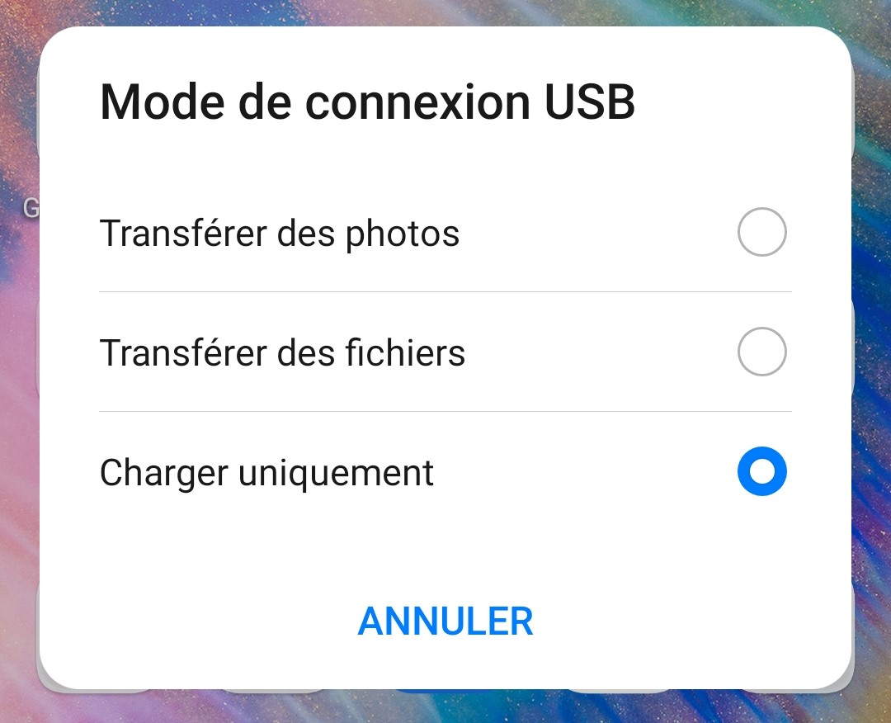
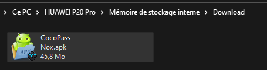
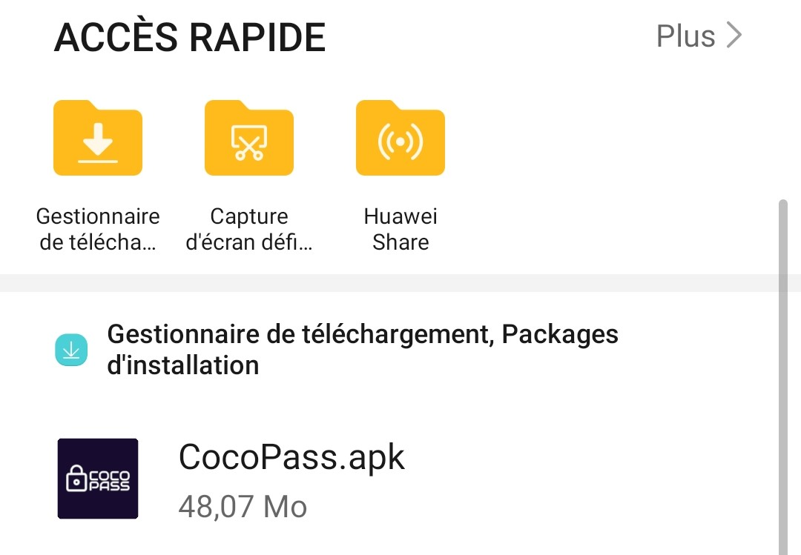
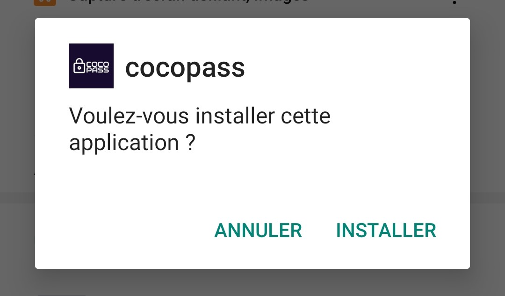
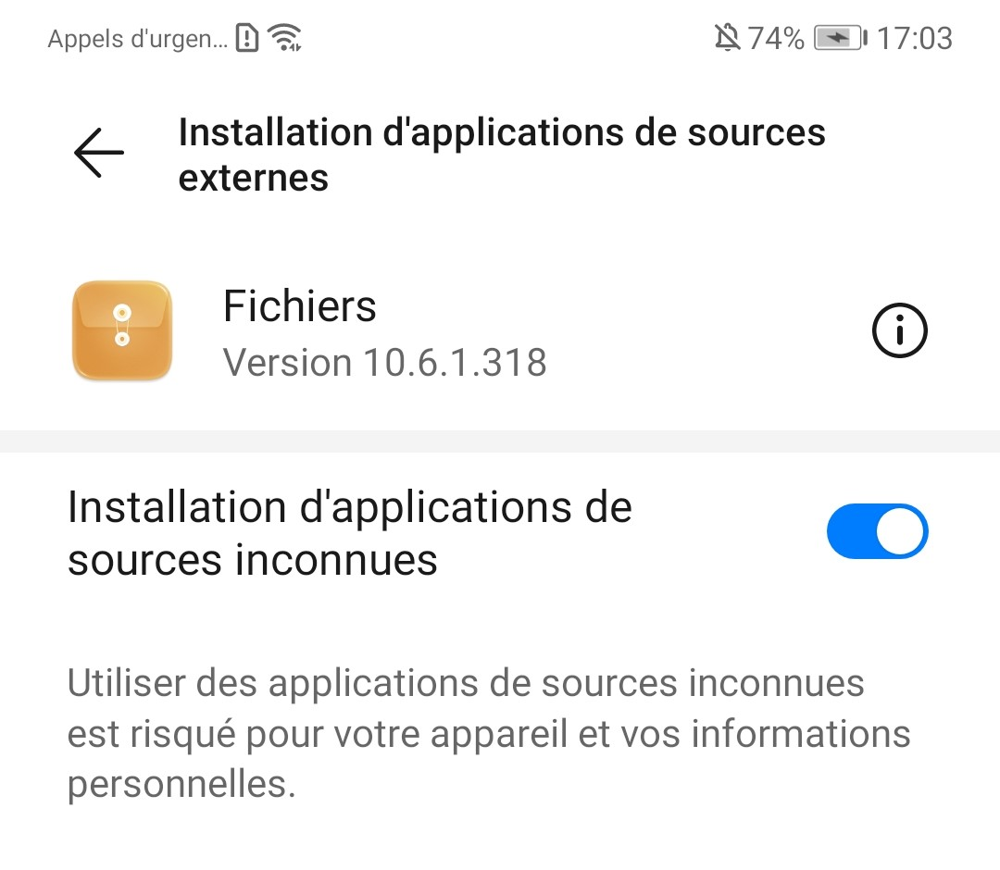
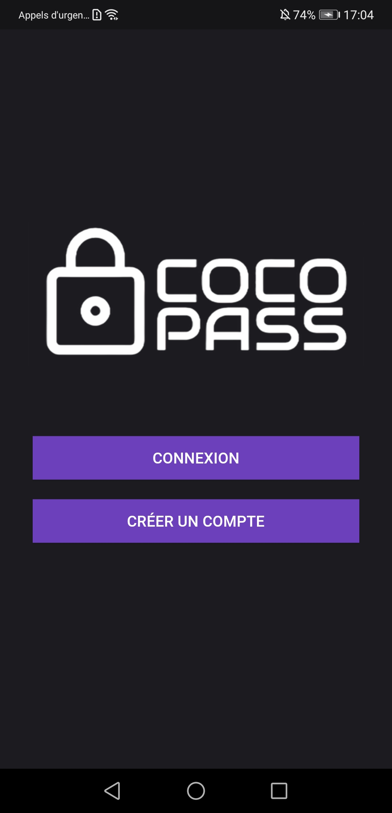

# Marche à suivre

La marche à suivre pour installer notre application est relativement simple puisqu'il s'agit d'une application android communiquant avec une base de données sur le cloud.

## Téléchargement

Pour ce faire, il suffit de télécharger l'apk présente dans le repository github. https://github.com/cgerro/CocoPass/tree/main/APK

## Transfert

Une fois fait, connecté votre smartphone android à l'aide d'un cable USB. Si le pop-up ci-dessous apparait, cliquez sur "transférer des fichiers".

Copiez ensuite l'apk dans un dossier de votre téléphone. Par exemple le dossier des téléchargements.

Ensuite, allez dans les fichiers de votre téléphone et localisez l'apk. 

## Installation

Cliquez dessus pour l'installer

Il est possible que cela vous demande une autorisation supplémentaire, cliquez sur paramètres et cochez la case comme ci-dessous :

Après cela, il faudra donc lancer l'installation et attendre quelques secondes avant que celle-ci ne soit terminée.

## Utilisation

Pour tester l'application, vous pouvez créer un nouveau compte et/ou utiliser le compte créé pour la présentation.

Les identifiants sont : heig@gmail.com et Heig1234567!

Bonne découverte !
